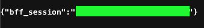

# Go Bucket Manager BFF

## Overview

This project is a backend-for-frontend (BFF) service designed to provide secure, controlled access to log files stored in object storage across multiple cloud providers: AWS S3, Google Cloud Storage (GCS), and Azure Blob Storage.

It exposes a RESTful API for listing and downloading log files, with a focus on security and modularity. The cloud infrastructure (buckets, service accounts, permissions) is managed entirely through Terraform, allowing for repeatable and version-controlled deployments.

## Tech Stack

- Golang
- Gin Gonic ( <https://gin-gonic.com/> )
- Docker
- Terraform
- AWS SDK, Google Cloud SDK, Azure SDK

## Prerequisites

Before you begin, ensure you have the following tools installed:

- Go SDK
- GoLand (or another IDE, could be VSCode)
- Docker & Docker Compose
- [Terraform](https://learn.hashicorp.com/tutorials/terraform/install-cli) (v1.0.0 or newer)
- [AWS CLI](https://aws.amazon.com/cli/)
- [Google Cloud CLI (gcloud)](https://cloud.google.com/sdk/docs/install)
- [Azure CLI (az)](https://docs.microsoft.com/cli/azure/install-azure-cli)

## 1. Infrastructure Setup with Terraform

Before running the application, you must set up the required cloud infrastructure (storage buckets, service accounts, permissions) using Terraform.

The detailed instructions for authenticating with your cloud providers and deploying the infrastructure are located in the `terraform/` directory.

**➡️ Please follow the instructions in `terraform/README.md` first.**

After running `terraform apply` successfully, Terraform will output the necessary credentials and resource names. You will use these outputs to configure the application in the next step.

## 2. Local Development Setup

### Step 2.1: Create the `.env` file

This project uses a `.env` file at the root of the project to manage environment variables for local development. This file is ignored by Git and should not be committed.

1. Create a file named `.env` in the project's root directory.
2. Copy the template below into the file and populate it with the values from the Terraform output and your Google OAuth Client credentials.

```bash
# .env file template

# -- Server Configuration --
SERVER_PORT=8000

# -- Security Configuration --
# Enable or disable security. Set to 'false' to bypass all authentication/authorization.
SECURITY_ENABLED=true

# -- JWT Configuration --
# A strong, random secret for signing JWTs. Must be at exactly 256 bits.
# You can generate one with: openssl rand -base64 32
JWT_SECRET=your-super-strong-jwt-secret-here

# -- Google OAuth2 Client Credentials --
# Create these in the Google Cloud Console under "APIs & Services" -> "Credentials"
# The authorized redirect URI should be http://localhost:8000/login/oauth2/code/google
GOOGLE_CLIENT_ID=your-google-client-id.apps.googleusercontent.com
GOOGLE_CLIENT_SECRET=your-google-client-secret

# -- AWS Configuration (from Terraform output) --
AWS_ENABLED=true # Set to false if not using AWS
AWS_REGION=us-east-1 # Or your desired region
AWS_ACCESS_KEY_ID=...
AWS_SECRET_ACCESS_KEY=...

# -- GCP Configuration (from Terraform output) --
GCP_ENABLED=true # Set to false if not using GCP
GCP_PROJECT_ID=your-gcp-project-id
# This is the base64 encoded content of the service account JSON key file
GCP_CREDENTIALS_BASE64=...

# -- Azure Configuration (from Terraform output) --
AZURE_ENABLED=true # Set to false if not using Azure
AZURE_STORAGE_CONNECTION_STRING=...
```

This project can use AWS, GCP, Azure or not, and use OAuth2 with Google or not. You can set the variables to false if you want to disable them.

### Step 2.2: Running the project

1. Clone the repository to your local machine.
2. Open the project directory in your IDE.
3. Ensure you have created and configured the .env file as described above.
4. Type go run cmd/main.go at your termminal and the application will run listening to the port 8000.

## 3. Dockerization

The application can also be run using Docker and Docker Compose, which is ideal for creating a consistent environment.

1. Ensure Docker is running on your machine.
2. Make sure you have a correctly configured .env file in the project root, as Docker Compose will inject these variables into the container.
3. Open a terminal in the project root and run the following command:

```shellscript
docker-compose up --build
```

This command will build the Docker image for the application and start the container. The service will be available at <http://localhost:8000> (or the custom port you configured).

To stop the service, press Ctrl+C in the terminal, and then run docker-compose down.

## 4. Authentication and Authorization Flow

The application uses a two-part authentication flow:

1. OAuth2/OIDC with Google: For initial user authentication via a web browser.
2. JWT: For securing API endpoints and allowing stateless communication from a client (e.g., a Single Page Application).

### Login Flow (OAuth2)

This flow establishes the user's identity.

1. A user accesses a protected page or clicks a "Login" button, which should direct them to <http://localhost:8000/oauth2/authorization/google>.
2. The BFF, configured as an OAuth2 Client, redirects the user to the Google login page.
3. The user authenticates with their Google account and grants consent.
4. Google redirects the user back to the application's configured redirect URI: <http://localhost:8000/login/oauth2/code/google>.
5. The application intercepts this redirect, exchanges the authorization code for an access token and user information, and creates an authenticated session.
6. By default, the user is redirected to /session upon successful login.

### API Authorization Flow (JWT)

Once the user is authenticated via OAuth2, the client application needs a way to make secure API calls without relying on the session cookie. This is done by obtaining a JWT.

1. Obtain a Token: After the OAuth2 login is successful, the client application should make a POST request to the /auth/token endpoint.

    ```bash
    curl --location --request POST 'http://localhost:8000/auth/token' \
    --header 'Cookie: bff_session=81853C717BD055FAE0A0C3DA7EA718B6;'
    ```

    The session id is exhibited after the login in the UI:

    

   Since the user has an active session, the BFF will generate a JWT signed with the JWT_SECRET. The response will look like this:

    ```json
    {
        "token": "ey...",
        "type": "Bearer",
        "expiresIn": 86400
    }
    ```

2. Use the Token: The client application must store this JWT securely and include it in the Authorization header for all subsequent requests to protected API endpoints (those under /api/**).

   ```http
    GET /api/v1/buckets
    Authorization: Bearer ey...
   ```

3. Token Validation: The JwtAuthenticationFilter on the server intercepts each request. It validates the JWT from the Authorization header. If the token is valid, it establishes a security context for the request, allowing access to the protected resource. If the token is missing, invalid, or expired, the server will respond with a 401 Unauthorized error.

### 5. API Endpoints

There is a Postman collection available in the `postman/` directory to help you test these endpoints easily.

All API endpoints require a valid JWT in the `Authorization: Bearer <token>` header.

#### List Files in a Bucket

Retrieves a list of all files within a specified bucket for a given cloud provider.

- **Endpoint**: `GET /api/v1/providers/:provider/buckets/:bucketName/files`
- **Path Parameters**:
  - `:provider` (string, required): The cloud provider. Can be `AWS`, `GCP`, or `AZURE`.
  - `:bucketName` (string, required): The name of the storage bucket.

- **Example Request**:

  ```bash
  curl --location 'http://localhost:8000/api/v1/providers/AWS/buckets/jschmidt-bff-log-storage-bucket-aws/files' \
  --header 'Authorization: Bearer <YOUR_JWT_TOKEN>'
  ```

- **Example Response**:

  ```json
  [
    {
        "fileName": "build.log",
        "size": 1048576,
        "lastModified": "2023-10-27T10:30:00Z"
    },
    {
        "fileName": "application-error.log",
        "size": 51200,
        "lastModified": "2023-10-27T11:00:00Z"
    }
  ]
  ```

#### Download a File

Downloads a specific file from a bucket. The response body will contain the raw file content.

- Endpoint: GET /api/v1/providers/:provider/buckets/:bucketName/files/:fileName/download
- Path Parameters:
  - :provider (string, required): The cloud provider. Can be AWS, GCP, or AZURE.
  - :bucketName (string, required): The name of the storage bucket.
  - :fileName (string, required): The name of the file to download, which must be URL-encoded if it contains special characters.
- **Example Request**:

  ```bash
  curl --location 'http://localhost:8000/api/v1/providers/AWS/buckets/jschmidt-bff-log-storage-bucket-aws/files/build.log/download' \
   --header 'Authorization: Bearer <YOUR_JWT_TOKEN>' \
   --output 'downloaded_build.log'
  ```

- **Example Response**:
  The response body is the binary content of the file. The following headers will be present:

  ```
  Content-Disposition: attachment; filename="build.log"
  Content-Type: application/octet-stream
  ```

#### Upload a File

Uploads a single file to a specified bucket.

- Endpoint: PUT /api/v1/providers/:provider/buckets/:bucketName/upload
- Path Parameters:
  - :provider (string, required): The cloud provider. Can be AWS, GCP, or AZURE.
  - :bucketName (string, required): The name of the storage bucket.
- Request Body: multipart/form-data with a single part:
  - file (file, required): The file to be uploaded.
- Example Request:

  ```bash
  curl --location --request PUT 'http://localhost:8000/api/v1/providers/AWS/buckets/jschmidt-bff-log-storage-bucket-aws/upload' \
  --header 'Authorization: Bearer <YOUR_JWT_TOKEN>' \
  --form 'file=@"/path/to/your/local/build.log"'
  ```

- Example Success Response: 200 OK with an empty body.

#### Get a Presigned URL for Download

Generates a temporary, presigned URL that can be used to download the specified file directly from the cloud provider without further authentication.

- Endpoint: GET /api/v1/providers/:provider/buckets/:bucketName/files/:fileName/presigned-url
- Path Parameters:
  - :provider (string, required): The cloud provider. Can be AWS, GCP, or AZURE.
  - :bucketName (string, required): The name of the storage bucket.
  - :fileName (string, required): The name of the file, which must be URL-encoded if it contains special characters.
- Example Request:

  ```bash
  curl --location 'http://localhost:8000/api/v1/providers/AWS/buckets/jschmidt-bff-log-storage-bucket-aws/files/build.log/presigned-url' \
  --header 'Authorization: Bearer <YOUR_JWT_TOKEN>'
  ```

- Example Response:

  ```json
  {
    "presignedUrl": "https://jschmidt-bff-log-storage-bucket-aws.s3.us-east-1.amazonaws.com/build.log?X-Amz-Algorithm=AWS4-HMAC-SHA256&X-Amz-Date=..."
  }
  ```

### 6. ADR

- [Architecture Decision Records (ADR)](adr/README.md) are used to document the architectural decisions made during the development of this project. Each decision is recorded in a separate file, providing context and reasoning for future reference.
